# Spring Boot là gì? Tại sao lại chọn Spring Boot?

Spring Boot là một dự án bổ sung của Spring, nhằm đơn giản hóa việc phát triển ứng dụng Spring.

Spring Boot sử dụng Annotation để định nghĩa Endpoint, giúp dễ dàng xây dựng các endpoint RESTful mà không cần phải viết nhiều mã cấu hình. Các Annotation phổ biến như @RestController, @GetMapping, @PostMapping giúp việc xử lý HTTP requests trở nên dễ dàng và linh hoạt hơn.

## Code thực thi dự án

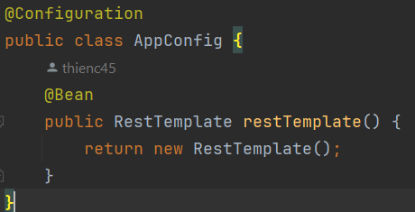
Cấu hình đối tượng bean RestTemplate để ghi và nhận dữ liệu từ trang web khác.

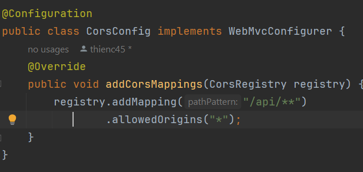
Cho phép các request từ các origin đã được chỉ định truy cập vào cấu hình chung thay vì sử dụng `@Crossing`.

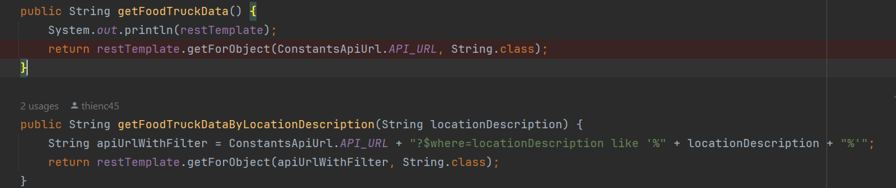
Cả hai phương thức `getFoodTruckData` và `getFoodTruckDataByLocationDescription` đều sử dụng RestTemplate để gửi yêu cầu HTTP đến một API nhất định và nhận dữ liệu phản hồi từ API đó.

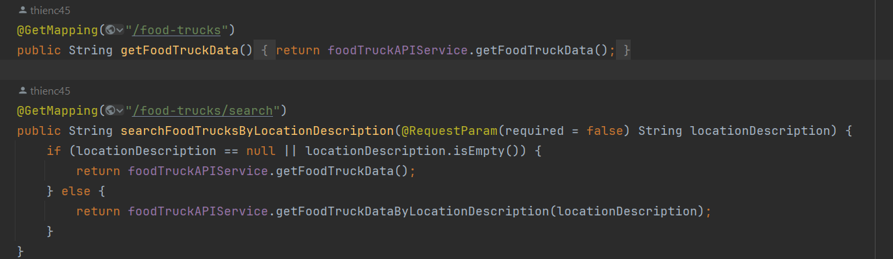
Tạo API tương ứng bằng cách sử dụng `@GetMapping` để tích hợp với phía front end. Sử dụng `@RestController`  để trả về dữ liệu dưới dạng JSON.


# Triển khai ứng dụng Spring Boot trên AWS EC2 sử dụng Putty

1.  **Tạo EC2 Instance**: Bắt đầu bằng việc tạo một EC2 Instance trên AWS Console.
    


2.  **Download private key file**: Sau khi tạo EC2 Instance, tải về tệp khóa riêng tư (.ppk).
    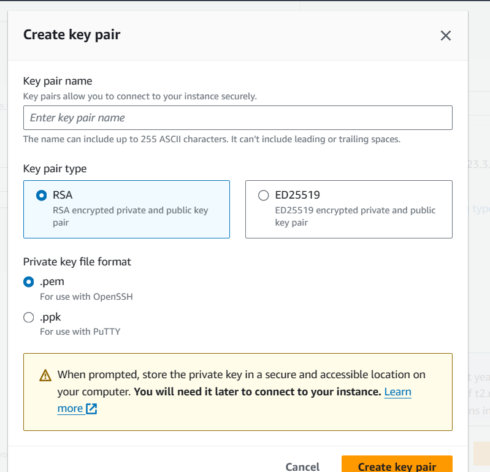

3.  **Thay đổi security group sử dụng port 8081**: Chỉnh sửa cấu hình nhóm bảo mật của EC2 Instance để mở cổng 8081 để có thể truy cập vào ứng dụng.
    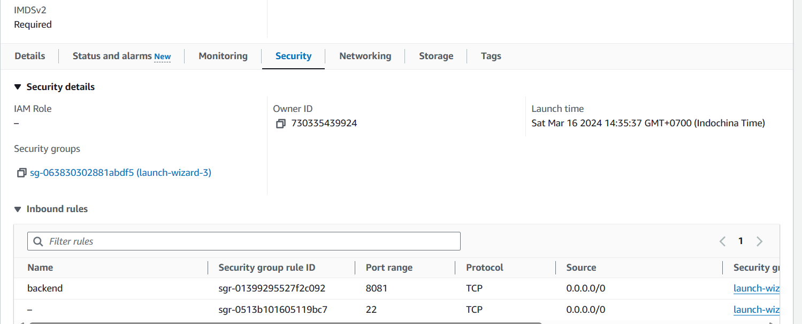

4.  **Kết nối EC2 sử dụng Putty**: Sử dụng Putty để kết nối với EC2 Instance bằng cách sử dụng địa chỉ IP công khai của EC2 và tệp khóa riêng tư (.pem).

        ```bash
        ec2-user@public_host
        ```

    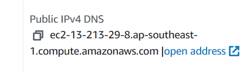
    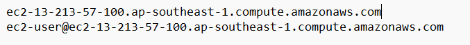
    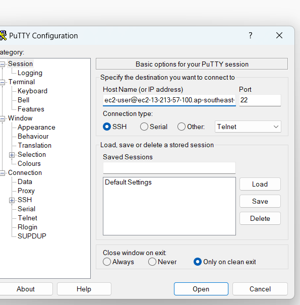

5.  **Thêm tệp .ppk vào Putty**: Sử dụng Puttygen để chuyển đổi tệp khóa riêng tư (.pem) sang định dạng .ppk, sau đó thêm tệp .ppk vào Putty để kết nối với EC2.
    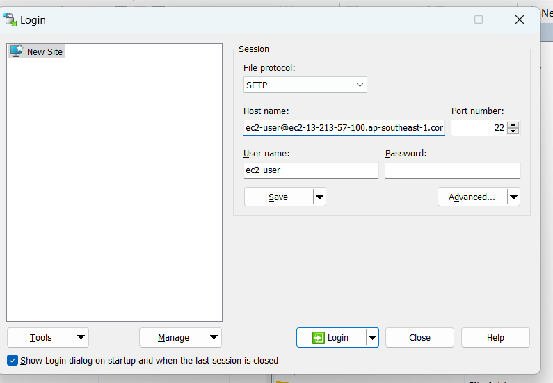

6.  **Copy tệp Jar đến EC2 sử dụng WinSCP**: Sử dụng WinSCP để sao chép tệp jar của ứng dụng Spring Boot từ máy cục bộ của bạn đến EC2 Instance.!
    [Alt text](image-7.png)
    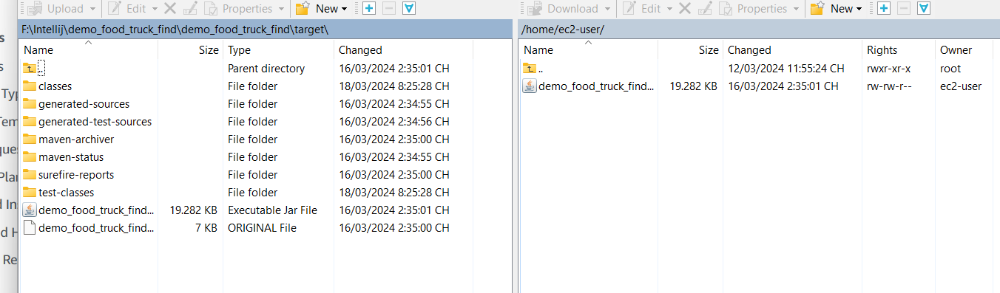

7.  **Cài đặt Java Development Kit trên EC2**: Chạy lệnh sau trên EC2 để cài đặt JDK:

    ```bash
    sudo yum install java-17-openjdk-devel
    ```

8.  **Chạy ứng dụng Java**: Sử dụng lệnh sau để chạy ứng dụng Java trên EC2:

    ```bash
    java -jar jar_name
    ```

###

- [GitHub back_end_foodStuckfind](https://github.com/thienc45/back_end_foodStuckfind.git)

- [GitHub font_end_foodStuckfind](https://github.com/thienc45/font_end_foodStuckFind.git)

- [Video demo foodStuckfind](https://1drv.ms/v/s!AvdQFkUv6DA8oC1112avAniNuWEr?e=TsuKnS)

