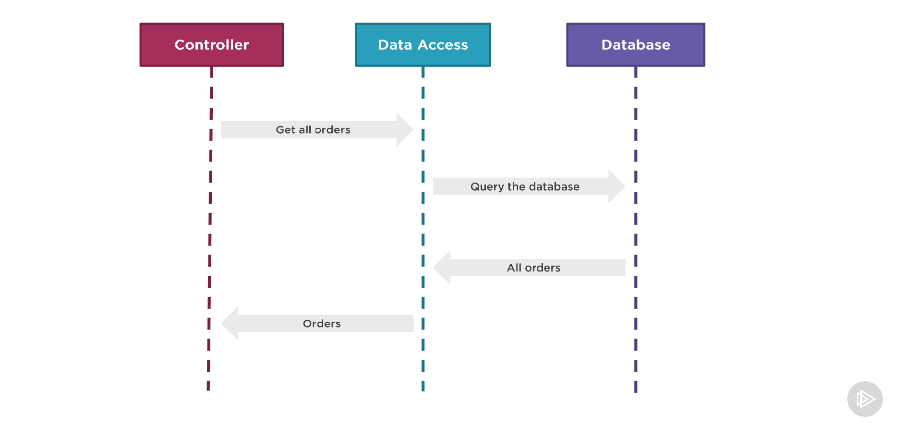
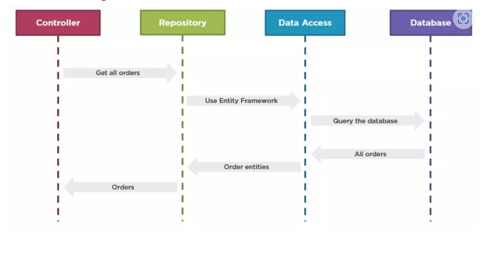

# Giới Thiệu: Repository Pattern



**Tại sao thiết kế này có vấn đề?**

- Bộ điều khiển được liên kết chặt chẽ với lớp truy cập dữ liệu
- Rất khó để viết một bài kiểm tra cho bộ điều khiển mà không có tác dụng phụ
- Khó mở rộng các thực thể có hành vi cụ thể theo miền.

Trong một dự án không sử dụng Repository Pattern, Controller gắn chặt với Model. Khi Model thay đổi, việc sửa đổi mã trong Controller trở nên rắc rối và dễ gây lỗi. Ví dụ, khi cần thay đổi tên của bảng "Products" thành "Title", bạn phải tìm và sửa lại mọi nơi trong Controller mà sử dụng tên "Products".

Nếu một ngày đẹp trời, khách hàng yêu cầu thay đổi cơ sở dữ liệu từ MySQL sang MongoDB, việc tìm và sửa lại các đoạn mã trong nhiều Controllers trở nên phiền phức và tốn thời gian. Sử dụng Repository Pattern giúp giải quyết vấn đề này bằng cách tạo ra một lớp trung gian giữa Controller và Model.

**Giải quyết vấn đề**

Chúng ta áp dụng kiểu thiết kế Repository Pattern. Áp dụng kiểu kĩ thuật này đơn giản chúng ta thêm 1 lớp Repository vào chính giữa 2 lớp Controller và Data Access để tách sự phụ thuộc của 2 thằng này Nhớ vậy mà việc viết test trở nên dễ dàng cũng như có thể mở rộng hay thay đổi Entites trước khi được truyền thẳng vào thằng Controller và giúp code sạch hơn.

Khi sử dụng Repository Pattern, việc sửa đổi Entity hoặc thay đổi cơ sở dữ liệu trở nên dễ dàng hơn. Thay vì phải sửa đổi mã trong nhiều Controllers, bạn chỉ cần thay đổi một chỗ duy nhất trong Repository và tất cả Controllers sử dụng Repository đó sẽ tự động được cập nhật theo.



## Ưu điểm của Mẫu Thiết kế Repository

## Truy cập Dữ liệu Tập Trung:

- Mẫu này tập trung và trừu tượng hóa logic truy cập dữ liệu, cho phép phần còn lại của ứng dụng tương tác với dữ liệu thông qua một giao diện nhất quán. Điều này đơn giản hóa việc bảo trì mã bằng cách quản lý tất cả các hoạt động liên quan đến dữ liệu ở một nơi.

## Khả năng Kiểm Thử Nâng Cao:

- Tách logic truy cập dữ liệu ra khỏi logic kinh doanh giúp việc kiểm thử đơn vị trở nên dễ dàng hơn. Với một giao diện rõ ràng cho các hoạt động dữ liệu, việc giả mạo hoặc thay thế repository làm cho việc kiểm thử các phần khác của ứng dụng trở nên đơn giản hơn.

## Cải Thiện Khả Năng Bảo Trì Mã:

- Mẫu thiết kế repository thúc đẩy mã sạch bằng cách cô lập logic truy cập dữ liệu. Sự phân tách này cho phép các nhà phát triển thay đổi hoặc tối ưu hóa truy cập dữ liệu mà không ảnh hưởng đến phần còn lại của ứng dụng.

## Tính Tái Sử Dụng và Mở Rộng:

- Bằng cách tuân thủ hợp đồng của repository, nhiều phần của ứng dụng có thể tái sử dụng các phương thức truy cập dữ liệu cùng một lúc. Điều này cho phép việc thêm các nguồn dữ liệu hoặc công nghệ mới một cách dễ dàng mà không cần thay đổi logic chính của ứng dụng.

# Nhược điểm của Mẫu Thiết kế Repository

## Tính Quá Tải Đối với Các Ứng Dụng Đơn Giản:

- Triển khai mẫu thiết kế repository có thể đưa ra sự phức tạp không cần thiết trong các ứng dụng nhỏ hoặc đơn giản. Trong những trường hợp như vậy, các lớp trừu tượng hóa thêm có thể làm cho việc phát triển trở nên cồng kềnh hơn là hữu ích.

## Thời Gian Học và Phát Triển:

- Áp dụng mẫu thiết kế repository có thể đòi hỏi thêm thời gian phát triển, vì nó bao gồm việc tạo các giao diện, xác định hợp đồng và triển khai các lớp repository cụ thể. Điều này có thể ảnh hưởng đến thời gian dự án.

## Rò Rỉ Trừu Tượng Hóa Tiềm Ẩn:

- Trong một số trường hợp, mẫu thiết kế repository có thể rò rỉ chi tiết triển khai cơ sở dữ liệu cho các lớp cao hơn, làm cho trừu tượng hóa trở nên ít hiệu quả hơn. Điều này có thể xảy ra nếu repository cần phục vụ các truy vấn hoặc hoạt động phức tạp.

# Các Trường Hợp Sử Dụng cho Mẫu Thiết kế Repository

## Ứng Dụng Web:

- Repository thường được sử dụng trong các ứng dụng web để quản lý truy cập dữ liệu đến cơ sở dữ liệu. Chúng trừu tượng hóa việc tương tác với cơ sở dữ liệu và làm cho việc chuyển sang hệ thống cơ sở dữ liệu khác trở nên dễ dàng hơn.

## APIs và Dịch Vụ:

- Khi xây dựng APIs hoặc dịch vụ microservices, Mẫu Thiết kế Repository có thể giúp quản lý truy cập dữ liệu một cách sạch sẽ và có tổ chức. Nó cho phép nhiều dịch vụ tương tác với dữ liệu một cách nhất quán.

## Hệ Thống Lớn và Phức Tạp:

- Đối với các hệ thống lớn, phức tạp nơi logic truy cập dữ liệu có thể trở nên rối rắm và lộn xộn, Mẫu Thiết kế Repository cung cấp một cách gọn gàng để xử lý cách dữ liệu được truy cập. Điều này làm cho mã dễ bảo trì và quản lý hơn.

## Môi Trường Kiểm Thử:

- Nó rất hữu ích trong môi trường kiểm thử nơi bạn muốn cô lập việc truy cập dữ liệu cho mục đích kiểm thử. Các repository giả mạo có thể được tạo ra để mô phỏng việc truy cập dữ liệu mà không cần thay đổi nguồn dữ liệu thực tế.

## Di Dời Dữ Liệu:

- Khi di dời dữ liệu từ một cơ sở dữ liệu sang một cơ sở dữ liệu khác, Mẫu Thiết kế Repository cho phép quá trình chuyển đổi mềm mại hơn. Bạn có thể thay thế triển khai của repository để làm việc với nguồn dữ liệu mới trong khi vẫn giữ nguyên phần còn lại của ứng dụng.

**Một ví dụ về các bước triển khai Design Pattern Repository Pattern**

## Triển khai

### 1. Tạo Entity Class

````java
import javax.persistence.Entity;
import javax.persistence.GeneratedValue;
import javax.persistence.GenerationType;
import javax.persistence.Id;

@Entity
public class Product {
    @Id
    @GeneratedValue(strategy = GenerationType.IDENTITY)
    private Long id;
    private String name;
    private double price;

    // Getters and setters
}

### 2. Tạo Repository Interface


import org.springframework.data.jpa.repository.JpaRepository;

public interface ProductRepository extends JpaRepository<Product, Long> {
}

### 3. Sử dụng Repository trong Service


import org.springframework.beans.factory.annotation.Autowired;
import org.springframework.stereotype.Service;
import java.util.List;
import java.util.Optional;

@Service
public class ProductService {
    private final ProductRepository productRepository;

    @Autowired
    public ProductService(ProductRepository productRepository) {
        this.productRepository = productRepository;
    }

    public List<Product> getAllProducts() {
        return productRepository.findAll();
    }

    public Optional<Product> getProductById(Long id) {
        return productRepository.findById(id);
    }

    public Product addProduct(Product product) {
        return productRepository.save(product);
    }

    public Product updateProduct(Product product) {
        return productRepository.save(product);
    }

    public void deleteProduct(Long id) {
        productRepository.deleteById(id);
    }
}

### 4. Tạo Controller

```java
import org.springframework.beans.factory.annotation.Autowired;
import org.springframework.http.HttpStatus;
import org.springframework.http.ResponseEntity;
import org.springframework.web.bind.annotation.*;
import java.util.List;
import java.util.Optional;

@RestController
@RequestMapping("/api/products")
public class ProductController {
    private final ProductService productService;

    @Autowired
    public ProductController(ProductService productService) {
        this.productService = productService;
    }

    @GetMapping
    public ResponseEntity<List<Product>> getAllProducts() {
        List<Product> products = productService.getAllProducts();
        return ResponseEntity.ok(products);
    }

    @GetMapping("/{id}")
    public ResponseEntity<Product> getProductById(@PathVariable Long id) {
        Optional<Product> product = productService.getProductById(id);
        return product.map(ResponseEntity::ok).orElseGet(() -> ResponseEntity.notFound().build());
    }

    @PostMapping
    public ResponseEntity<Product> addProduct(@RequestBody Product product) {
        Product newProduct = productService.addProduct(product);
        return ResponseEntity.status(HttpStatus.CREATED).body(newProduct);
    }

    @PutMapping("/{id}")
    public ResponseEntity<Product> updateProduct(@PathVariable Long id, @RequestBody Product product) {
        if (!productService.getProductById(id).isPresent()) {
            return ResponseEntity.notFound().build();
        }
        product.setId(id);
        Product updatedProduct = productService.updateProduct(product);
        return ResponseEntity.ok(updatedProduct);
    }

    @DeleteMapping("/{id}")
    public ResponseEntity<Void> deleteProduct(@PathVariable Long id) {
        if (!productService.getProductById(id).isPresent()) {
            return ResponseEntity.notFound().build();
        }
        productService.deleteProduct(id);
        return ResponseEntity.noContent().build();
    }
}


````
